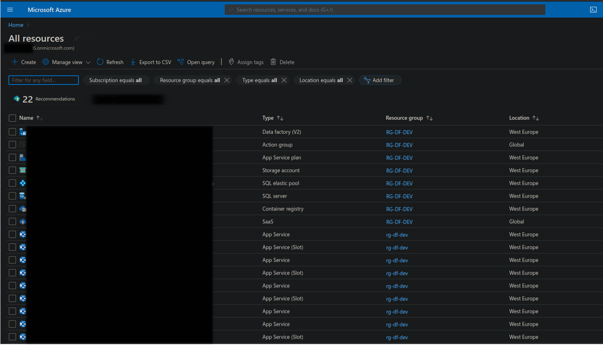
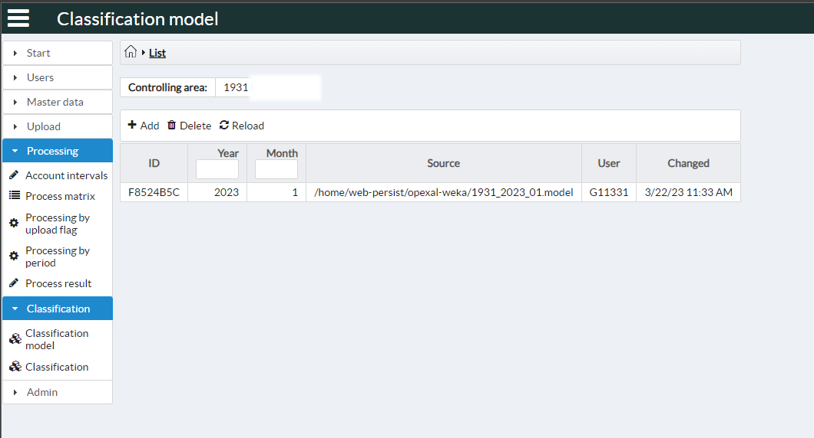
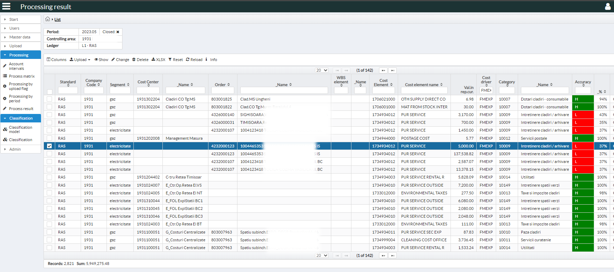

# Java Enterprise Edition Application for expense record classification using Bayesian ML model

## Status
- Minimal Viable Product
- used in production by a big corporate company for more than 2 year as of now

## Features
- OpenID Connect login for MS Azure AAD
- Dockerized with private repository
- Azure DevOps CI/CD
- REST endpoints for BluePrism RPA based data feed (data extracted from SAP reports)
- Cloud based
- Mail notification for errors and tasks
- Cron jobs
- .xlsx/ .csv/ .txt files upload/ download
- MS SQL server backend
- Bilingual UX
- Responsive UX

## Dependencies
- Glassfish Application Server
- Nimbus
- Weka ML
- JDBC (no ORM)
- Apache POI
- JavaFaces
- Weld CDI
- Docker

# Screen captures

### Cloud resource overview

### ML Model list

### Classified records
